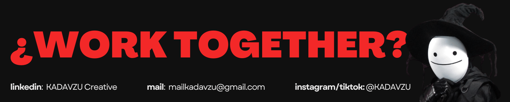

# KADAVZU Creative

  

  <h1>Visual Designer & Full Stack Developer</h1>
  <i>"Where disruptive art meets solid code."</i>

---

### 🛠 Technologies

  
  
  
  
   
  
   
  

---

### 📊 Performance

  
  

---

### 🚀 Featured Projects

### 🚀 Featured Projects

<table border="0">
  <tr>
    <td width="40%">
      
    </td>
    <td width="60%" valign="top">
      <a href="https://github.com/KADAVZU/VanillaGuard-UI"><b>Vanilla Guard JS</b></a> 
      Interfaz de seguridad disruptiva para entornos JS. Enfoque en lógica de autenticación robusta y UI minimalista.
    </td>
  </tr>
  <tr><td colspan="2" height="10"></td></tr>
  <tr>
    <td width="40%">
      
    </td>
    <td width="60%" valign="top">
      <a href="https://github.com/KADAVZU/spaceX"><b>SpaceX Launch Tracker</b></a> 
      Visualizador de lanzamientos utilizando la API oficial de SpaceX. Interfaz dinámica y diseño inspirado en el espacio.
    </td>
  </tr>
  <tr>
    <td width="40%">
      
    </td>
    <td width="60%" valign="top">
      <a href="https://github.com/KADAVZU/proyectoWeb"><b>Modern Web Project</b></a> 
      Desarrollo web con enfoque "Mobile First" y arquitectura CSS avanzada para una respuesta fluida en cualquier dispositivo.
    </td>
  </tr>
  <tr><td colspan="2" height="10"></td></tr>
  <tr><td colspan="2" height="10"></td></tr>
  <tr>
    <td width="40%">
      
    </td>
    <td width="60%" valign="top">
      <a href="https://github.com/KADAVZU/javascriptAPIs"><b>JavaScript API Hub</b></a> 
      Implementación técnica de consumo de datos asíncronos y manejo de estados en aplicaciones modernas.
    </td>
  </tr>
  <tr><td colspan="2" height="10"></td></tr>
  <tr>
    <td width="40%">
      
    </td>
    <td width="60%" valign="top">
      <a href="https://github.com/KADAVZU/virtualWallet"><b>Virtual Wallet</b></a> 
      Gestión financiera personal con una UI limpia y control de transacciones optimizado.
    </td>
  </tr>
  <tr><td colspan="2" height="10"></td></tr>
  <tr>
    <td width="40%">
      
    </td>
    <td width="60%" valign="top">
      <a href="https://github.com/KADAVZU/ecommerCampusM1"><b>Ecommerce Campus M1</b></a> 
      Plataforma de ventas optimizada para dispositivos móviles con enfoque en UX y conversión.
    </td>
  </tr>
</table>

---

### 🔗 Connect with the Void

  
  
  
  

---
